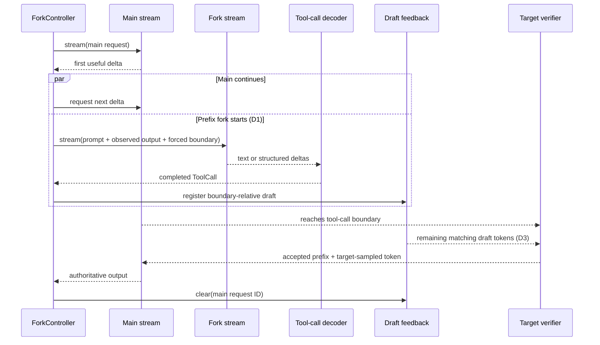

# Architecture

`self-speculation` extracts two reusable mechanisms from SPORK:

1. **D1-style streaming fork:** after the first useful main-stream delta, start
   one continuation that shares the already-populated prefix and force it onto a
   tool-call branch.
2. **D3-style action drafting:** decode the fork into a complete action, encode
   that action as boundary-relative draft tokens, and offer those tokens to the
   still-running main request for ordinary target-model verification.

Agent loops, tool execution, benchmark harnesses, datasets, scheduling policy,
and evaluation code are intentionally outside this package.

## End-to-end flow



The fork predicts an action; it never replaces the main stream. When D3 is
enabled, the target engine verifies every proposed token using its normal
speculative-decoding path. Rejected tokens therefore fall back to target-model
decoding instead of changing the model's output distribution.

## Components

### Normalized inference contract

An engine implements one asynchronous method:

```python
class InferenceEngine(Protocol):
    name: str
    capabilities: EngineCapabilities

    def stream(self, request: InferenceRequest) -> AsyncIterator[StreamChunk]: ...
```

`InferenceRequest` supports either a raw prompt or chat messages. `StreamChunk`
keeps visible text, reasoning text, token IDs, token logprobs, structured
tool-call deltas, finish reasons, and provider-native payloads separate.

Built-in adapters cover arbitrary callbacks, OpenAI-compatible SSE servers, and
native vLLM asynchronous generation. A custom engine only needs to normalize
its output into this contract.

### Fork construction

`PrefixForkBuilder` appends the main stream's observed output and a forced
tool-call boundary to the original rendered prompt. Starting after the first
delta follows SPORK's D1 timing and lets engines with automatic prefix caching
reuse the main request's populated prefix. `CallableForkBuilder` supports
engines that need a different continuation or session API.

The fork is opened at most once. Main and fork iterators then advance as
independent asyncio tasks; a slow fork does not stop consumption of the main
stream.

### Streaming tool-call decoding

`StreamingToolCallDecoder` accepts both structured provider deltas and raw text.
For text, `ParserRegistry` tries configured branches in order, locks onto the
first matching parser, and deduplicates completed calls. Parser instances keep
partial state, so JSON strings, XML tags, and special-token markers may span
arbitrary transport chunks.

When `PrefixForkBuilder` forces a boundary that the engine will not echo, pass
that text as `initial_text` to `default_decoder`. This reconstructs the logical
stream seen by the parser.

### Draft construction and feedback

`ToolCallDraftBuilder` separates model-format concerns from engine transport:

- a formatter serializes decoded calls after, but not including, the boundary;
- a tokenizer encodes both the draft body and textual boundary;
- an optional resolver supplies the main prompt token count;
- `max_draft_tokens` bounds work offered to the verifier.

The resulting `DraftRequest` travels through one of several `DraftFeedback`
implementations:

- `CallableDraftFeedback` for local engines or application callbacks;
- `HTTPDraftFeedback` for a portable request-scoped sidecar;
- `SporkHTTPDraftFeedback` for the original SPORK endpoint contract;
- `BoundaryDraftFeedback` for an in-process `BoundaryDraftStore`;
- vLLM collective-RPC and HTTP adapters for the custom proposer integration.

### Engine-side boundary proposer

`BoundaryDraftStore` is independent of vLLM and uses stable request IDs. For
each proposer step it:

1. excludes exactly `prompt_token_count` tokens, so historical tool calls in a
   chat prompt cannot trigger the current draft;
2. finds the last occurrence of a single- or multi-token boundary;
3. rejects a draft outside `inject_window`;
4. requires every body token already generated by the main request to equal a
   prefix of the draft;
5. skips that common prefix and offers only the ungenerated suffix;
6. marks the draft fired, ensuring at most one thread receives it.

Registration, proposal, replacement, cleanup, and metrics are protected by one
re-entrant lock. Different requests never share proposal state.

## Failure semantics

The main stream is authoritative, so its exceptions always propagate. Fork and
draft work are acceleration paths and default to best-effort behavior:

| Stage | Default behavior | Strict option |
| --- | --- | --- |
| Fork build, stream, or decode | emit `ForkFailedEvent`; main continues | `strict_fork_errors=True` re-raises |
| Draft build, submit, or clear | emit `DraftFailedEvent`; main continues | `strict_draft_errors=True` re-raises |
| Consumer cancellation | cancel pending tasks, close iterators, best-effort draft cleanup | always applied |

Typed events expose lifecycle transitions without requiring callers to parse
logs. `ForkController.run()` collects the same information into `ForkRunResult`.

## Engine integration levels

An engine can adopt the library incrementally:

| Level | Requirements | Result |
| --- | --- | --- |
| Streaming fork | normalized stream + a fork request builder | speculative tool-call prediction |
| Prefix-efficient fork | automatic prefix/KV cache reuse | D1 latency reduction |
| Action feedback | tokenizer + request-scoped side channel | decoded action reaches engine |
| Verified D3 | stable request-ID mapping + boundary proposer + target verification | speculative action tokens can reduce decode steps |

Without the last level, the decoded fork is still useful for prefetching or
application policy, but it does not accelerate target-model token generation.

## Security boundary

Draft registration routes influence inference execution and must be treated as
administrative endpoints. Keep them on a trusted network or protect them with a
reverse proxy. In particular, vLLM API-key handling may not cover plugin routes
outside `/v1`; the bundled endpoint plugin is opt-in and namespaced under
`/self-speculation` for this reason.

## Upstream relationship

The design and D1/D3 terminology come from
[SPORK](https://github.com/baihuajun24/spork) and its
[paper](https://arxiv.org/abs/2607.03333). This repository preserves the
upstream Git history, MIT license, and explicit attribution in `NOTICE.md`.
